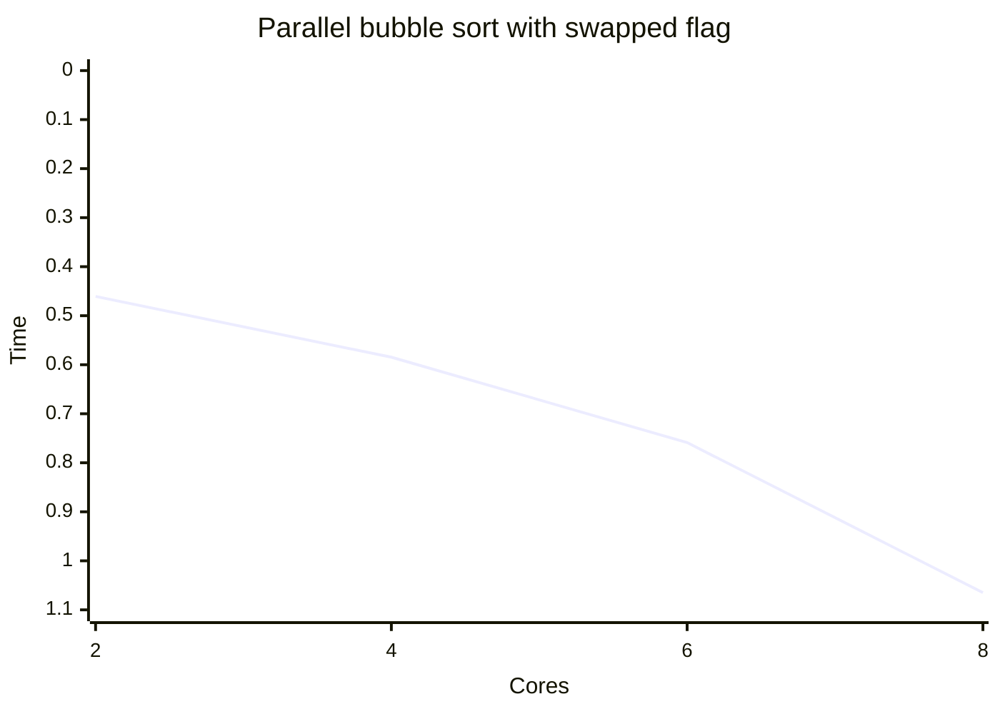

# Bubble sort parallel implementation

## Motivation

The purpose of the assignment is to design and implement efficient parallel algorithm for bubble sort algorithm using
shared memory multithreaded parallel system and experimentally investigate the speedup and scalability of the
application.

## Problem

Bubble sort is not an efficient algorithm with a complexity of O(n^2), which means that with large data sets it quickly becomes slow.
So this projects goal is to see if parallelization could help and increase its efficiency.

## Algorithm parallelization

Bubble sort can be created using the swapped flag or not. So for this project two versions of this sort were created.
Both of them use the Odd and Even separation pattern in which we eliminate dependencies to adjacent elements.
This odd even separation allows us to parallelize as we reduce the risk of race condition.

For Thread control the OpenMP library was used to simplify thread creation and management.

## Experiment

In this experiment I wanted to find out what would be the average run time for each defined bubble sort algorithm.

Experiment details:

- Each algorithm was run 100 times.
- Data set was 10000
- System used was macbook pro m1 with 8 cores

### Bubble sort

- Average time taken to sort with 10000 dataset: 0.420109 seconds

### Bubble sort with swapped flag

- Average time taken to sort with 10000 dataset: 0.421125 seconds

### Parallel bubble sort

- Average time taken to sort with 10000 dataset and 2 of cores: 0.414565 seconds
- Average time taken to sort with 10000 dataset and 4 of cores: 0.459515 seconds
- Average time taken to sort with 10000 dataset and 6 of cores: 0.51781 seconds
- Average time taken to sort with 10000 dataset and 8 of cores: 0.658508 seconds

```mermaid
xychart-beta
    title "Parallel bubble sort"
    x-axis "Cores" [2, 4, 6, 8]
    y-axis "Time" 1 --> 0
    line [0.414565, 0.459515, 0.51781, 0.658508]
    line [0.414565, 0.459515, 0.51781, 0.658508]
```

### Parallel bubble sort with swapped flag

- Average time taken to sort with 10000 dataset and 2 of cores: 0.460546 seconds
- Average time taken to sort with 10000 dataset and 4 of cores: 0.584587 seconds
- Average time taken to sort with 10000 dataset and 6 of cores: 0.758808 seconds
- Average time taken to sort with 10000 dataset and 8 of cores: 1.06499 seconds

- Average time taken to sort with 100000 dataset and 8 of cores: 17.2787 seconds



## Conclusions

The expectation for this experiment was to see a decrease in time after parallelization, uninformatively the results are opposite.
Increase in cores increases the time it takes to compute each time. This could be due to:

- Bubble sort is hard to parallelize - each phase requires a sequential dependency.
- As number of cores increases the synchronization between cores becomes more expensive. Thread creation and scheduling, barriers and load balancing are all expensive and inefficient in small data sets.
- Parallelization could show increase in efficiency with large data sets, but bubble sort itself is not efficient as data increases.

So my final conclusions would be that while it is plausible to parallelize this algorithm, it could only be useful at large data sets.
But due to inherit inefficiencies of this algorithm and its time complexity with large datasets it is better to use a more efficient algorithm.
