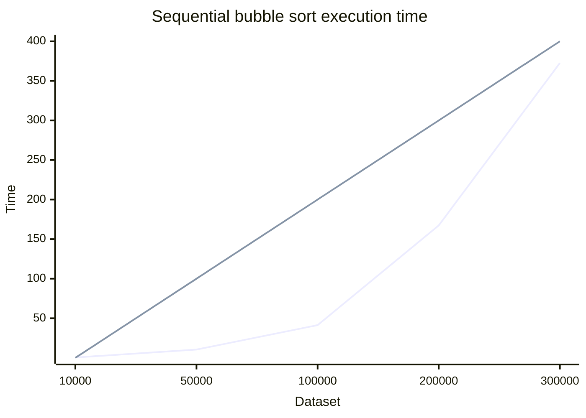
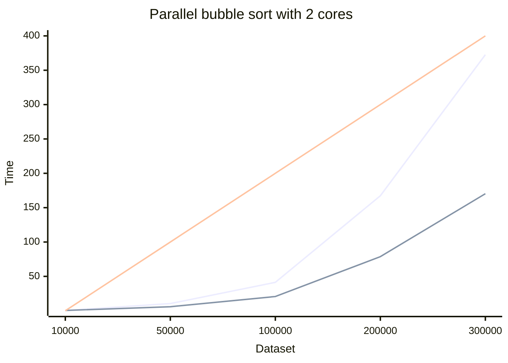
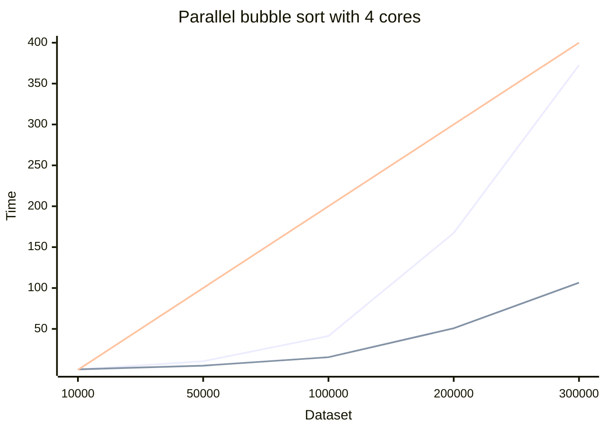
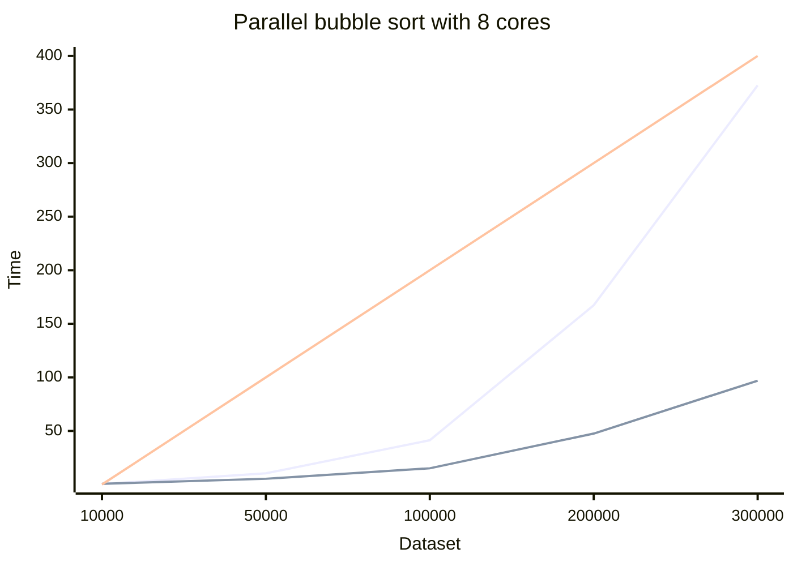
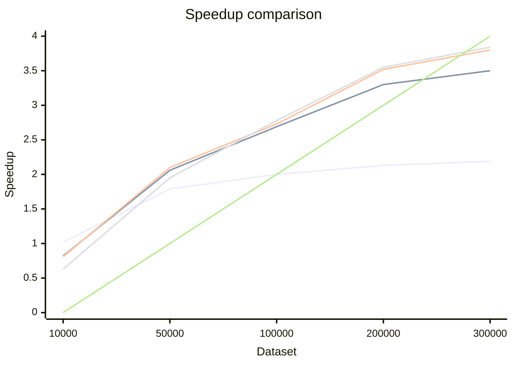

# Report: Parallel Algorithm Design and Implementation

## 1. Introduction

### 1.1 Problem Description

This research explores parallelizing bubble sort across multiple CPU threads. While bubble sort is simple but
inefficient (O(n^2) complexity), the study tests if running it on 8 cores in parallel can improve its performance. The
focus is on measuring speed gains and scalability using shared-memory multithreading.

### 1.2 Objectives

The objectives of this assignment are:

- To design and implement a parallel version of the bubble sort algorithm.
- To analyze how the algorithm’s workload can be divided into independent tasks suitable for multithreaded execution.
- To experimentally measure the speedup achieved by parallelizing the algorithm.
- To investigate the scalability of the parallel implementation and identify factors that influence its performance.

---

## 2. Parallelization Approach

### 2.1 Work Division

For this bubble sort implementation work is divided using the Odd/Even methods. This approach separates bubble sort loop
into two distinct parts - one that checks item sizes with the indexes being even and one with them being odd. This
approach because these phases do not interfere with one another, so different threads can work independently,

### 2.2 Sub-work Allocation

The division of work here works with cyclical allocation. Threads are give a specific part of the cycle to compute with
the answer then being merged back in the shared data array.

### 2.3 Synchronization

The OpenMP library that is used for parallelization uses a barrier at the end of the for loop. This means that all work
in this phase must be complete before moving on to another phase. Synchronisation happens:

- Within a phase - threads operate on independent pairs of elements, so no synchronization is needed during the loop
  iterations.
- Between phases - OpenMP’s implicit barrier ensures all threads complete their work before moving to the next phase.
- Shared data - the main thread manages isEvenPhase, and there is no contention because it is updated sequentially
  outside the parallel region.

---

## 3. Experimental Setup

### 3.1 System Description

Experiment has been done on macbook m1 pro machine that has 8 cores in total

### 3.2 Experimental Parameters

- Testing has been done with 10000, 50000, 10000, 200000 and 300000 randomly generated data sets.
- For speed reference sequential run of bubble sort algorithm has been used.
- Test was done with 2, 4, 6 and 8 cores.

---

## 4. Results and Analysis

### 4.1 Results

**Test run results sequentially:**

| Dataset Count | Sequential Run (s) | 
|---------------|--------------------|
| 10000         | 0.420052           | 
| 50000         | 10.429007          |
| 100000        | 41.319766          | 
| 200000        | 167.328850         | 
| 300000        | 372.563921         | 

**Test run results using 2 cores:**

| Dataset Count | Sequential Run (s) | Parallel Run (s) | Speedup |
|---------------|--------------------|------------------|---------|
| 10000         | 0.420052           | 0.412430         | 1.02x   |
| 50000         | 10.429007          | 5.825340         | 1.79x   |
| 100000        | 41.319766          | 20.679956        | 2.00x   |
| 200000        | 167.328850         | 78.722583        | 2.13x   |
| 300000        | 372.563921         | 170.288452       | 2.19x   |

- Red line - reference
- Blue line - sequential
- Green line - parallel

**Test run results using 4 cores:**

| Dataset Count | Sequential Run (s) | Parallel Run (s) | Speedup |
|---------------|--------------------|------------------|---------|
| 10000         | 0.420052           | 0.513024         | 0.82x   |
| 50000         | 10.429007          | 5.074885         | 2.06x   |
| 100000        | 41.319766          | 15.379939        | 2.69x   |
| 200000        | 167.328850         | 50.761146        | 3.30x   |
| 300000        | 372.563921         | 106.569182       | 3.50x   |

- Red line - reference
- Blue line - sequential
- Green line - parallel

**Test run results using 6 cores:**

| Dataset Count | Sequential Run (s) | Parallel Run (s) | Speedup |
|---------------|--------------------|------------------|---------|
| 10000         | 0.420052           | 0.519214         | 0.81x   |
| 50000         | 10.429007          | 4.962971         | 2.10x   |
| 100000        | 41.319766          | 14.861962        | 2.78x   |
| 200000        | 167.328850         | 47.126572        | 3.55x   |
| 300000        | 372.563921         | 98.099047        | 3.80x   |

- Red line - reference
- Blue line - sequential
- Green line - parallel

**Test run results using 8 cores:**

| Dataset Count | Sequential Run (s) | Parallel Run (s) | Speedup |
|---------------|--------------------|------------------|---------|
| 10000         | 0.420052           | 0.662177         | 0.63x   |
| 50000         | 10.429007          | 5.354895         | 1.95x   |
| 100000        | 41.319766          | 15.127752        | 2.73x   |
| 200000        | 167.328850         | 47.526918        | 3.52x   |
| 300000        | 372.563921         | 96.900925        | 3.84x   |

- Red line - reference
- Blue line - sequential
- Green line - parallel

**Speedup comparison:**

- Blue - 2 threads
- Green - 4 threads
- Red - 6 threads
- Yellow - 8 threads
- White - reference

## 5. Conclusions

### 5.1 Key Findings

Using the parallel version of bubble sort does in fact speed up the algorithm execution.
With small datasets more threads seem to perform a bit worse, but increase in data sets sees a quite substantial
speedup.
Speedup sees to not follow linear increase but taper and slow down a bit with larger data sets.

### 5.2 Limitations and Challenges

Thread creation and usage with smaller datasets is more expensive, so more threads here does provide a good speedup.
The bubble sort algorithm itself is not efficient using large datasets, so to have more efficient sorting with large
data it would be better to use different algorithms, not just parallelization.