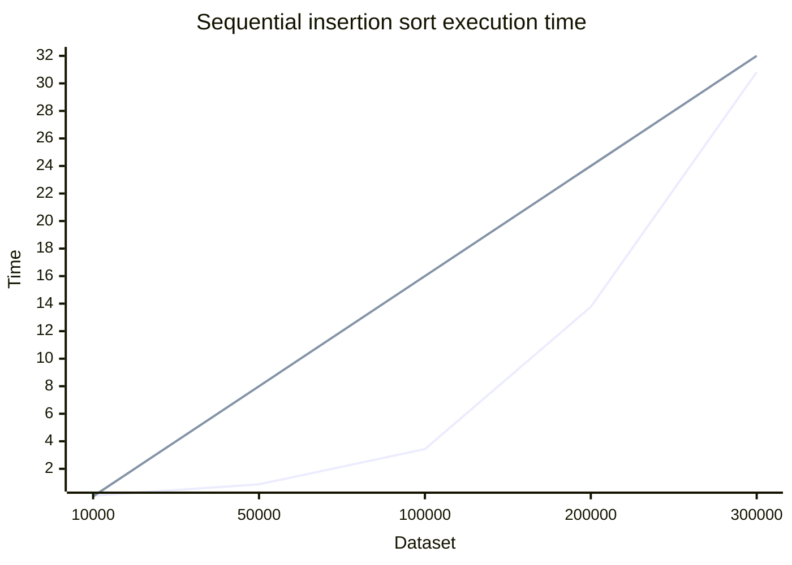
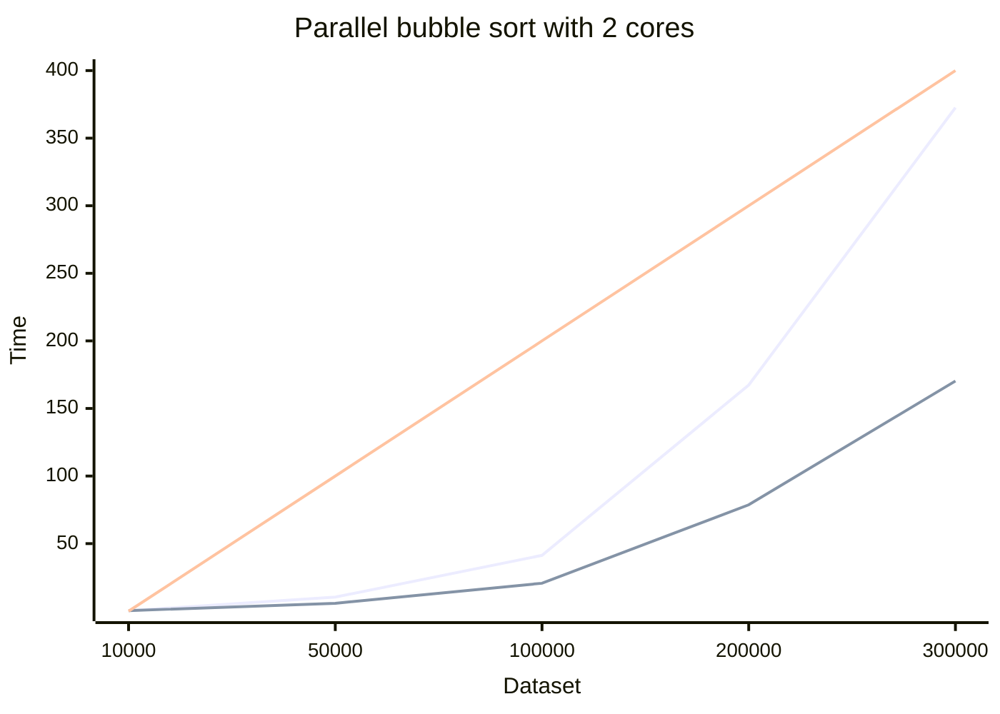
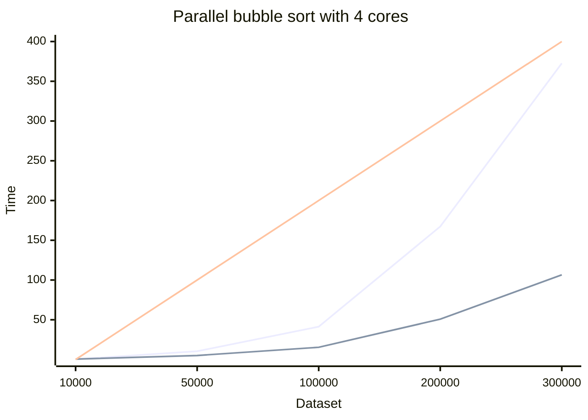
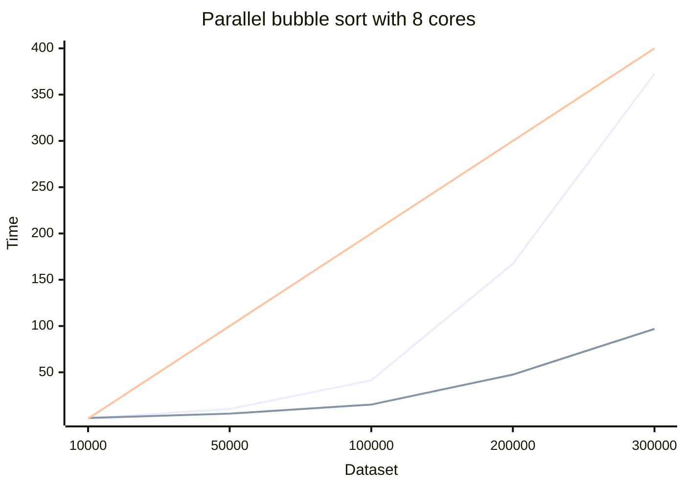
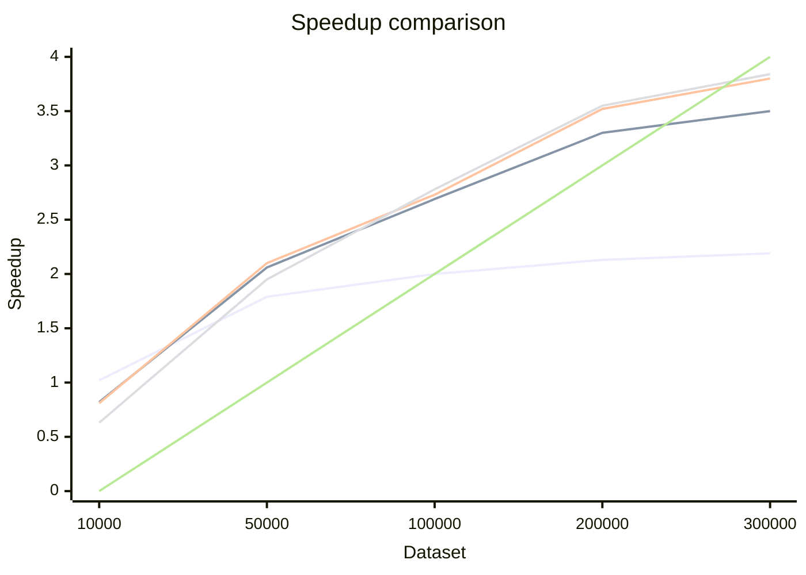

# Report: Parallel Algorithm Design and Implementation

## 1. Introduction

### 1.1 Problem Description

For this exercise the problem is to parallelize insertion sort to increase its efficiency.

### 1.2 Objectives

The objectives of this assignment are:

- To design and implement a parallel version of the insertion sort algorithm.
- To analyze how the algorithm’s workload can be divided into independent tasks suitable for multithreaded execution.
- To experimentally measure the speedup achieved by parallelizing the algorithm with 256 processors.

---

## 2. Parallelization Approach

### 2.1 Work Division

### 2.2 Sub-work Allocation

### 2.3 Synchronization

---

## 3. Experimental Setup

### 3.1 System Description

Experiment has been done on MIF cluster with 256 cores.

### 3.2 Experimental Parameters

- Testing has been done with 10000, 50000, 100000, 200000 and 300000 randomly generated data sets.
- For speed reference sequential run of insertion sort algorithm has been used.
- Test was done with 256 cores.

---

## 4. Results and Analysis

### 4.1 Results

**Test run results sequentially:**

| Dataset Count | Sequential Run (s) | 
|---------------|--------------------|
| 10000         | 0.053376000        | 
| 50000         | 0.872704000        |
| 100000        | 3.430480000        | 
| 200000        | 13.763848000       | 
| 300000        | 30.821927000       | 

**Test run results using 2 cores:**

| Dataset Count | Sequential Run (s) | Parallel Run (s) | Speedup |
|---------------|--------------------|------------------|---------|
| 10000         | 0.420052           | 0.412430         | 1.02x   |
| 50000         | 10.429007          | 5.825340         | 1.79x   |
| 100000        | 41.319766          | 20.679956        | 2.00x   |
| 200000        | 167.328850         | 78.722583        | 2.13x   |
| 300000        | 372.563921         | 170.288452       | 2.19x   |

- Red line - reference
- Blue line - sequential
- Green line - parallel

**Test run results using 4 cores:**

| Dataset Count | Sequential Run (s) | Parallel Run (s) | Speedup |
|---------------|--------------------|------------------|---------|
| 10000         | 0.420052           | 0.513024         | 0.82x   |
| 50000         | 10.429007          | 5.074885         | 2.06x   |
| 100000        | 41.319766          | 15.379939        | 2.69x   |
| 200000        | 167.328850         | 50.761146        | 3.30x   |
| 300000        | 372.563921         | 106.569182       | 3.50x   |

- Red line - reference
- Blue line - sequential
- Green line - parallel

**Test run results using 6 cores:**

| Dataset Count | Sequential Run (s) | Parallel Run (s) | Speedup |
|---------------|--------------------|------------------|---------|
| 10000         | 0.420052           | 0.519214         | 0.81x   |
| 50000         | 10.429007          | 4.962971         | 2.10x   |
| 100000        | 41.319766          | 14.861962        | 2.78x   |
| 200000        | 167.328850         | 47.126572        | 3.55x   |
| 300000        | 372.563921         | 98.099047        | 3.80x   |

- Red line - reference
- Blue line - sequential
- Green line - parallel

**Test run results using 8 cores:**

| Dataset Count | Sequential Run (s) | Parallel Run (s) | Speedup |
|---------------|--------------------|------------------|---------|
| 10000         | 0.420052           | 0.662177         | 0.63x   |
| 50000         | 10.429007          | 5.354895         | 1.95x   |
| 100000        | 41.319766          | 15.127752        | 2.73x   |
| 200000        | 167.328850         | 47.526918        | 3.52x   |
| 300000        | 372.563921         | 96.900925        | 3.84x   |

- Red line - reference
- Blue line - sequential
- Green line - parallel

**Speedup comparison:**

- Blue - 2 threads
- Green - 4 threads
- Red - 6 threads
- Yellow - 8 threads
- White - reference

## 5. Conclusions

### 5.1 Key Findings

Using the parallel version of bubble sort does in fact speed up the algorithm execution.
With small datasets more threads seem to perform a bit worse, but increase in data sets sees a quite substantial
speedup.
Speedup sees to not follow linear increase but taper and slow down a bit with larger data sets.

### 5.2 Limitations and Challenges

Thread creation and usage with smaller datasets is more expensive, so more threads here does provide a good speedup.
The bubble sort algorithm itself is not efficient using large datasets, so to have more efficient sorting with large
data it would be better to use different algorithms, not just parallelization.