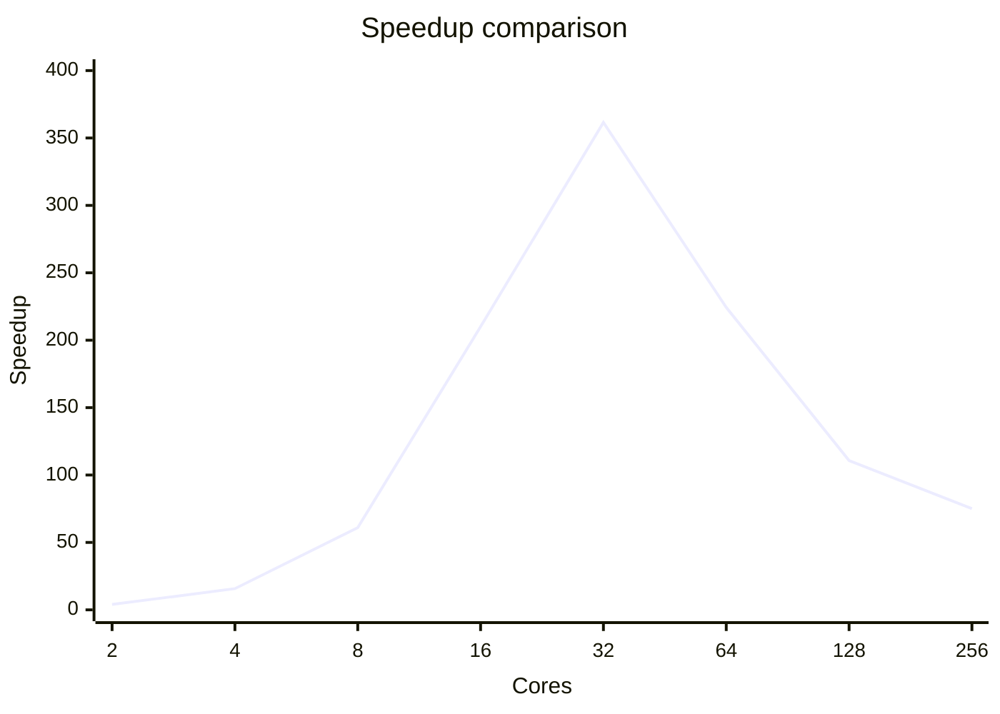

# Report: Parallel Algorithm Design and Implementation

## 1. Introduction

### 1.1 Problem Description

This research explores parallelizing insertion sort across multiple CPU threads. Insertion sort time complexity is O(n²) in worst/average case, O(n) in best case. Leveraging parallelization we can increase the speed of execution.

### 1.2 Objectives

The objectives of this assignment are:

- To design and implement a parallel version of the insertion sort algorithm.
- To analyze how the algorithm’s workload can be divided into independent tasks suitable for multithreaded execution.
- To experimentally measure the speedup achieved by parallelizing the algorithm.
- To investigate the scalability of the parallel implementation and identify factors that influence its performance.

## 2. Parallelization Approach

### 2.1 Work Division

The algorithm divides the main sorting task into smaller independent subtasks by:

- Splitting the initial array of size N into P equal chunks, where P is the number of processes.
- Each chunk has size N/P elements.
- This division creates independent sorting tasks that can be executed in parallel.
- The division is handled by MPI's scatter operation, ensuring even distribution of data.

### 2.2 Sub-work Allocation

The allocation and execution of subtasks is managed through:

- Process 0 (root) initially holds the complete array
- MPI_Scatter distributes equal portions to all processes
- Each process receives its chunk and performs sequential insertion sort independently
- Local sorting requires no communication between processes during the sorting phase
- Each process is responsible for sorting its own N/P elements
  The sorting phase is completely parallel with no interdependencies

### 2.3 Synchronization

The algorithm requires several synchronization points:

**Initial Distribution:**

- MPI_Scatter synchronizes all processes during data distribution
- Ensures all processes have received their data before beginning local sort

**Local Sorting Phase:**

- No synchronization needed during this phase
- Each process works independently on its local data
  Natural parallelism with zero communication overhead

**Final Merge Phase:**

- MPI_Gather synchronizes the collection of sorted chunks
- Process 0 performs the final merge of sorted sequences
- Other processes wait until their data is collected
- Barrier ensures timing measurements are accurate

## 3. Experimental Setup

### 3.1 System Description

Experiment has been done on VU MIF cluster that can use up to 256 cores.

### 3.2 Experimental Parameters

- Testing has been done with 100000 dataset.
- For speed reference sequential run of bubble sort algorithm has been used.
- Test was done with 2, 4, 8, 16, 32, 64, 128 and 256 cores

---

## 4. Results and Analysis

### 4.1 Results

**Speedup comparison for 100000 dataset:**

**Additional run with 1000000 dataset on 256 cores:**

- Array size: 1000000
- Number of processes: 256
- Sequential time: 887.675637 seconds
- Parallel time: 0.899620 seconds
- Speedup: **986.722799**

## 5. Conclusions

### 5.1 Key Findings

For an array size of 100,000 elements, parallelization showed optimal performance at 32 cores with a 361x speedup. Performance degraded beyond this point, dropping to 75x speedup at 256 cores, indicating that communication overhead began to outweigh computational benefits. However, when tested with 1,000,000 elements on 256 cores, the implementation achieved a 986x speedup, demonstrating that the algorithm scales effectively with larger datasets where the computation-to-communication ratio remains favorable.

### 5.2 Limitations and Challenges

The parallel insertion sort implementation faces several significant constraints that impact its scalability and efficiency. The sequential merging phase creates a bottleneck at the root process, limiting overall performance as core count increases. Uneven work distribution occurs due to insertion sort's O(n²) complexity, leading to processor idle time. Additionally, when the problem size is small relative to the number of cores, communication overhead dominates computation time, explaining the performance degradation observed beyond 32 cores with smaller datasets.
